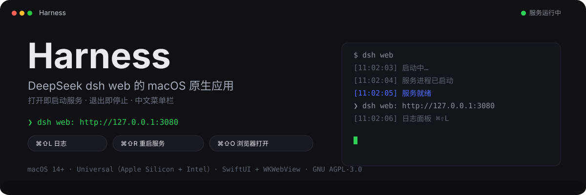
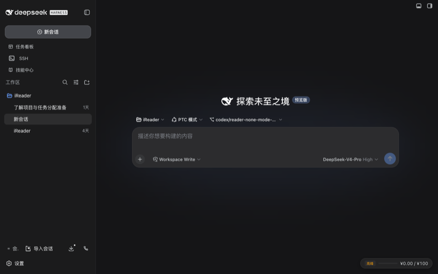

<p align="center">
  
</p>

<p align="center">
  
</p>

**Harness** 把 [DeepSeek Harness](https://github.com/deepseek-ai/dsh)（dsh）的 Web 工作台包装成原生 macOS 应用 —— 打开即启动服务、退出即停止，内置实时日志与中文菜单栏。

## 它解决什么

在浏览器里用 dsh 需要自己记着「先 `dsh web` 再打开页面，用完后杀掉进程」。Harness 把这一整段变成两个动作：

| 动作 | 发生的事 |
|---|---|
| **打开应用** | 启动内置的 dsh 服务（2 秒就绪）、加载工作台 |
| **关闭窗口** | 服务随之停止，不留孤儿进程 |

下载即可用：Node.js 与 dsh 都已捆绑在应用里，不需要预先安装任何东西，也不必等首次启动下载几百 MB 依赖。

## 下载安装

到 [Releases](https://github.com/aexachao/dsh-mac-app/releases/latest) 下载对应你 Mac 架构的 dmg：

| 你的 Mac | 下载 |
|---|---|
| Apple Silicon（M1/M2/M3/M4） | `Harness-<版本>-macos-apple-silicon.dmg` |
| Intel | `Harness-<版本>-macos-intel.dmg` |

不确定是哪种：左上角  → 「关于本机」，「芯片」写 Apple M 系列就是 Apple Silicon。**装错架构起不来**，原因见下文「为什么按架构出包」。

1. 打开 dmg
2. 把 **Harness** 拖到「应用程序」
3. 从「应用程序」（或启动台）里打开

第三步的措辞是认真的：不要直接在 dmg 窗口里双击运行。macOS 会把还带隔离标记的应用搬到一个只读临时挂载点里执行（App Translocation），路径每次启动都不一样，于是单实例锁认不出自己、文件夹访问授权反复弹窗。

发布包经 Apple 公证并装订票据，正常情况下双击即可打开，不需要右键或去「隐私与安全性」里放行。如果某次发布的说明里出现了签名降级的提示（CI 缺证书时会退回自签），按那段提示操作。

想校验完整性：Release 里的 `SHA256SUMS.txt` 对应 `shasum -a 256 <下载的 dmg>`。

## 功能

- **开箱即用** — 定版的 Node.js 与 dsh 随应用分发（按架构出包，下载对应你 Mac 的那个），不依赖本机环境；也可在设置中改用本机安装的 dsh
- **服务生命周期** — 打开启动 / 退出停止；`⌘⇧R` 彻底重启（自动清理残留进程），插件或配置变更一次生效
- **单实例** — 重复打开（含 `open -n`、两份不同路径的拷贝）只会把已有窗口叫到前台，不会起第二个服务去抢同一份 `~/.dsh` 配置
- **快速启动** — 用捆绑的运行时时不做任何网络检查，2 秒内就绪；端口可连即显示界面
- **日志面板** — 菜单 `⌘⇧L` 打开独立日志窗口；启动失败时主界面自动展开错误日志；密钥、Cookie、OAuth 回调参数在写入前自动脱敏，日志可直接贴到 issue
- **失败可自救** — 启动失败按原因分类，直接给出下一步（配置出错在 Finder 中定位、内置 dsh 与 `~/.dsh` 版本错位时一键改用本机的 dsh、异常退出附最后一条报错并可导出诊断）
- **安全模式** — 连续 3 次启动异常后自动停用第三方插件启动，横幅列出停用了什么并可一键退出；菜单也能手动进入。停用只走应用自己目录下的配置 overlay，不改动 `~/.dsh`
- **沉浸式界面** — 隐藏标题栏、深色窗口背景，网页内容铺满窗口
- **浏览器兜底** — `⌘⇧O` 在 Chrome 打开同一界面（WebView 流式渲染卡顿时）
- **中英文界面** — 简体中文默认；设置中可切换 English，菜单栏、状态提示、失败说明、安全模式横幅全部随之切换，重启后应用与 dsh 界面语言同步

## 构建

```bash
# 本地迭代：单架构、不捆绑运行时（找不到内置运行时会自动退回本机 node）
ARCHS=arm64 ./scripts/build.sh

# 发布形态：捆绑定版运行时（只能单架构，见下）
BUNDLE_RUNTIME=1 ARCHS=arm64 NO_INSTALL=1 ./scripts/build.sh

# 发布签名 + 公证（需要 Developer ID 证书与 App Store Connect 密钥）
CODESIGN_IDENTITY="Developer ID Application: <名字> (<TeamID>)" \
  NOTARIZE=1 BUNDLE_RUNTIME=1 ARCHS=arm64 ./scripts/build.sh

# 运行单元测试
swift test
```

> **为什么按架构出包**：dsh 的依赖树里有平台专属的原生模块（`@img/sharp-darwin-*`、`@koromix/koffi-darwin-*`、`node-pty` 预构建），一份 `node_modules` 只能属于一个架构，universal 包装不进两份互斥的树。所以 `BUNDLE_RUNTIME=1` 拒绝多架构，Release 也按 `apple-silicon` / `intel` 分别出包。

> **签名**：默认用自签名证书（`Harness Local Signing`）签名，仅限本机；钥匙串里没有时退回 ad-hoc。加固运行时（`--options runtime`）在本地构建也开着，免得「本地能跑、公证版起不来」这种差异等到发布后才暴露。捆绑的 node 单独带 JIT 与库校验豁免（V8 的硬需求 + 让用户自己装的第三方原生插件能加载），应用本体一条豁免都不给。

## 技术说明

- 原生 SwiftUI + WKWebView（无 Electron），AppKit 手动入口掌控菜单与窗口
- 服务以 `node <dsh 入口> --profile web --port <端口> --no-open` 直接子进程运行，退出时干净终止。三个参数都不是可选的写法：`dsh web` 子命令形式会拒绝父级的 `--profile` / `--patch`（安全模式的配置 overlay 正是靠 `--patch` 进去的），端口由应用先探测可绑定再显式传入，`--no-open` 则是因为 dsh 自己会去开系统浏览器——而应用窗口本身就是那个页面
- 运行时解析（`RuntimeLocator`，纯函数）：捆绑那份完整就用它 → 否则本机 node + npx 缓存里的 dsh → 有 node 没 dsh 就先装 → 都没有则报「缺 node」。设置里打开「改用本机 dsh」后前两条对调，但本机连 node 都没有时仍回到捆绑那份——能启动比尊重偏好重要。`swift run` 的开发构建没有 `.app` 外壳，查找自然全部落空，日常开发不受捆绑影响
- 捆绑布局由 `scripts/vendor-runtime.sh` 写入 `Contents/Resources/runtime/`（`node/`、`dsh/`、`manifest.json`）；三条相对路径是脚本与应用之间唯一的接口，被单元测试钉死——改一边忘了改另一边只会静悄悄退回下载路径，不报任何错
- 签名与公证：所有嵌套 Mach-O 由内向外逐个签（不用 `--deep`），全程开加固运行时；JIT / 未签名可执行内存 / 关闭库校验三条豁免只给捆绑的 node，应用本体没有任何豁免。`scripts/notarize.sh` 先本地预检（签名权威、`runtime` 标志、时间戳）再送 Apple，票据装订到 `.app` 之后才打 dmg；dmg 本身再签名、公证、装订一次——应用里的票据不解除容器的隔离标记
- 发布按架构出两个 dmg，`runtime-pins.json` 锁定 node 与 dsh 版本（含 SHA256）；`follow-upstream.yml` 每天检查上游并开 PR，node 只在锁定的大版本内跟随
- `ServerManager` 状态机：`starting / running / external / failed`；显式指定端口、冲突时退让、只清理可确认的 dsh 残留进程
- 单实例锁用 `flock` 而非 pid 文件（`~/Library/Application Support/Harness/instance.lock`）：锁随进程消失，崩溃后不会留下解不开的死锁；抢不到锁就激活已有实例并退出
- 安全模式：静态扫描 `~/.dsh/profiles/web` 的 `package.json` + 各 bundle 的 `cordis.patch.yml` 得到插件清单（不需要 dsh 能启动），把「停用第三方插件」写成 `~/Library/Application Support/Harness/safe-mode.yml`，以 `--patch` 叠加
- 日志脱敏后同时进内存缓冲区与 `~/Library/Logs/Harness/`（分段轮转、目录总量封顶、只清理自己写的文件）；「文件 → 导出诊断信息…」可一键导出环境与最近日志
- 菜单栏中英文两套，界面文案集中在 `Strings.swift`（穷尽 switch + 遍历全部 key 的不变量测试，漏一种语言编译不过、英文位抄成中文测试不过）；日志行故意保持单语，方便原样贴进 issue
- 语言偏好同步写入 dsh 的 `~/.dsh/settings.yaml`（`locale.preference`）

## 目录结构

```
Sources/DSHWeb/
├── main.swift               # AppKit 入口（菜单不被 SwiftUI 覆盖）
├── DSHWebApp.swift          # 应用生命周期与窗口创建
├── AppDirectories.swift     # 应用自己的目录（Application Support/Harness）
├── InstanceLock.swift       # 单实例锁（flock，崩溃后自动释放）
├── AppRelaunch.swift        # 自重启：等旧进程真正退出后再 open
├── ServerManager.swift      # 服务进程：启动/停止/重启/日志/状态机
├── ServerArguments.swift    # 拼给 dsh 的启动参数（纯函数）
├── RuntimeLocator.swift     # 用捆绑的还是本机的运行时（纯判定）+ 逃生开关持久化
├── PortStrategy.swift       # 端口选择策略 + 本地端口占用判定
├── DSHProcessIdentity.swift # 核对进程确实是 dsh（接管或清理前）
├── SecretMasker.swift       # 日志脱敏（密钥 / Cookie / OAuth 参数）
├── LogRotation.swift        # 落盘日志命名/时序/清理策略（纯函数）
├── LogFileSink.swift        # 日志落盘与轮转（~/Library/Logs/Harness）
├── DiagnosticsReport.swift  # 诊断报告渲染（导出前整份脱敏）
├── StartupHealth.swift      # 启动是否真的成功（纯判定）+ 连续失败计数持久化
├── FailureCause.swift       # 失败原因分类与恢复动作（纯值类型）
├── PluginInventory.swift    # 静态枚举 profile 装了哪些插件（不依赖 dsh 能启动）
├── SafeMode.swift           # 安全模式 overlay 渲染/写盘 + 开关持久化
├── MenuBuilder.swift        # 中英文菜单栏 + 语言偏好 + dsh 语言同步
├── Strings.swift            # 界面文案表（中英双语，穷尽 switch 保证不漏）
├── ContentView.swift        # 主界面：三态内容区 + 日志面板
├── AppState.swift           # 菜单与视图共享的 UI 状态 + 长命 WebViewController
├── LogPanel.swift           # 独立日志窗口
├── SettingsView.swift       # 设置（语言切换、改用本机 dsh）
├── WebViewController.swift  # WKWebView 封装（性能优化）
└── WindowAccessor.swift     # 窗口外观（隐藏标题栏、深色背景）
scripts/
├── build.sh                 # SwiftPM 编译 → .app 组装 → 签名 → 公证 → 安装
├── vendor-runtime.sh        # 按 runtime-pins.json 备好 node 与 dsh（校验 SHA256）
├── notarize.sh              # 本地预检 → 送 Apple 公证 → 装订票据 → Gatekeeper 复核（.app 与 .dmg 通用）
├── make-dmg.sh              # .app → dmg（带「应用程序」符号链接，可选签名与公证）
├── import-signing-cert.sh   # CI：把 Developer ID 证书导入临时钥匙串
└── check-upstream.sh        # 检查上游版本并更新 runtime-pins.json
runtime-pins.json            # 捆绑运行时的版本锁（node / dsh + SHA256）
assets/runtime.entitlements  # 只给捆绑 node 的三条豁免
```

## 依赖

- macOS 14+
- 其他都不用装。Node.js（24.20.0）与 DeepSeek Harness（0.1.1-rc.2）随应用分发，版本锁在 `runtime-pins.json`，构建时按 SHA256 校验后才打进包
- 只有在设置里打开「改用本机 dsh」时才需要本机 Node.js（自动探测 nvm / Homebrew / 系统路径），dsh 缺失时会通过 npx 安装

代价是包变大：捆绑的运行时未压缩约 384 MB（node 134 MB + dsh 依赖树 250 MB），压缩进 dmg 后约 115 MB。换来的是首次启动不下载、不联网、不受本机环境影响。

## 开源协议与贡献

- 本仓库采用 [GNU AGPL-3.0](LICENSE)。
- 贡献指南见 [CONTRIBUTING.md](CONTRIBUTING.md)（开发环境、代码规范、测试要求、提交流程）。
